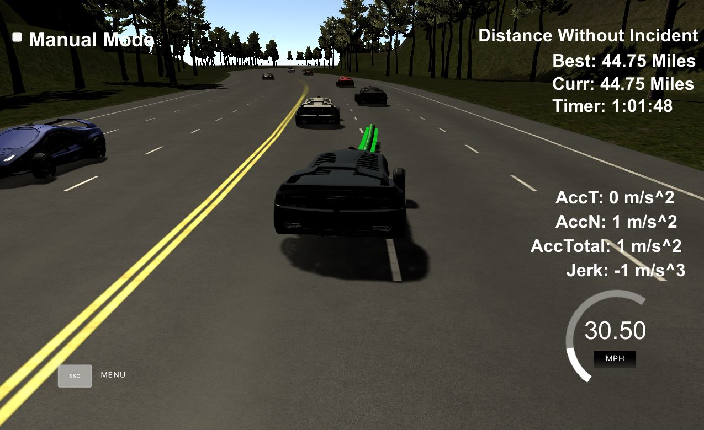

# CarND-Path-Planning-Project
Self-Driving Car Engineer Nanodegree Program


# Reflection

This code provides path planning for use with the term3 simulator and is written in C++ contained in the `main.cpp` source.  All reference to lines are in `main.cpp`.  

Initially the code accepts from the simulator the current car information x, y, s, d, yaw, car-speed along with the remaining previous path that was not used since the simulator invoked the planning code.  It also recieves sensor data about the other cars on the road i.e. the id, x, y, vx, vy, s, d of each car (See lines 396-414). 

## Same Lane Frontal Collision Avoidance ##
The first for loop starting on line 425 goes through all the other cars on the road and determines if one of them in my lane is on a collision course.  Determining if the other car is in same lane is done by calculating the lane range on line 434 through 438 based on the assumption of a 4 meter lane width.
```
float lbound = 2+4*lane-2;
float rbound = 2+4*lane+2;
```
The other car's s is then calculated out in to the future to match my car's s value which was set to the last value in the previous path...
```
if( prev_size > 0 ) {
   car_s = end_path_s;
}
...
check_car_s+=((double)prev_size*.02*check_speed)
```
The difference in the calculated position of the other car and my car is used to determine one of three levels of decleration on lines 446-456. Following this there is also code to determine if a car in another lane is crossing in to my lane and could cause a collision.  The deceleration level will be set to 4 causing maximum deceleration to avoid the collision (See lines 461-465). 

Once out of the loop that processes each car on the road, the reference velocity is set based on the level set above (lines 491-512). 


## Path planner/lane changer ##
The path planner function called `lane_changer()` will be invoked if any of the deceleration levels were set, thus only looking for a new path if the current path was hindered.  The lane_changer() function goes through the loop of all the cars on the road and determines best routes of either stay in the current lane, change left, or change right.  This function will add cost to changing lanes as it goes. The variables kcost (stay in lane), rcost (lane change right), and lcost (lange change left) are increased as the situations are assessed.
The first check makes the cost very high if it is not possible to go right or to the left.
The second check is done on whether my car could safely change to the left or right lane by looking for any cars there (lines 222-243).

## Spline ##

## Ticker ##

## Discussion ##
Although this planner works very well, many improvements could be made to this planner.  Use of a trained gaussian classifier predictive probably would have been a better choice for planning lanes but in the interest of time I went with a brute force approach which took a lot of tinkering to get it right.  


   

