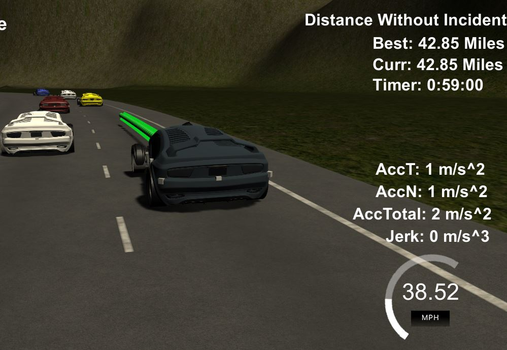

# CarND-Path-Planning-Project
Self-Driving Car Engineer Nanodegree Program



# Reflection

This code provides path planning for use with the Udacity Term 3 Simulator and is written in C++ contained in the `main.cpp` source.  All reference to lines in this document are to `src/main.cpp`.  Note that much of the code from the project walk-through was used.

Initially the code accepts from the simulator the current car information x, y, s, d, yaw, car-speed along with the remaining previous path that was not used since the simulator invoked the planning code.  It also recieves sensor data about the other cars on the road i.e. the id, x, y, vx, vy, s, d of each car (See lines 396-414). 

## Same Lane Frontal Collision Avoidance ##
The first for loop starting on line 425 goes through all the other cars on the road and determines if one of them in my lane is on a collision course.  Determining if the other car is in same lane is done by calculating the lane range on line 434 through 438 based on the assumption of a 4 meter lane width.
```
float lbound = 2+4*lane-2;
float rbound = 2+4*lane+2;
```
The other car's s is then calculated out in to the future to match my car's s value which was set to the last value in the previous path...
```
if( prev_size > 0 ) {
   car_s = end_path_s;
}
...
check_car_s+=((double)prev_size*.02*check_speed)
```
The difference in the calculated position of the other car and my car is used to determine one of three levels of decleration on lines 446-456. Following this there is also code to determine if a car in another lane is crossing in to my lane and could cause a collision.  The deceleration level will be set to 4 causing maximum deceleration to avoid the collision (See lines 461-465). 

Once out of the loop that processes each car on the road, the reference velocity is set based on the level set above (lines 491-512). 


## Path planner/lane changer ##
The path planner function called `lane_changer()` will be invoked (line 520) if any of the deceleration levels were set, thus only looking for a new path if the current path was hindered.  The lane_changer() function goes through the loop of all the cars on the road and determines best routes of either stay in the current lane, change left, or change right.  This function will add cost to changing lanes as it goes. The variables kcost (stay in lane), rcost (lane change right), and lcost (lane change left) are increased as the situations are assessed.

The first check makes the cost very high too go left if the car is already in the far left or to go right and the car is already in the far right lanes.
The second check is done on whether my car could safely change to the left or right lane by looking for any cars beside my car (lines 222-243).

Another check is done to see if there is an accelerating car coming from behind in either side lane.  A calculation based on future location in 30 steps on all cars behind mine is done to see if my car and the other car will collide thus making the cost high to perform that action (See lines 290-316).

A choice, only if my car is in the center lane, is made between left and right lanes if the keep-lane cost is high; it chooses the lane right or left lane with the lowest cost (See lines 321-325).
```
if( kcost > rcost || kcost > lcost ) {
   if( lcost <= rcost )  								
	   lane_to_return--; //Change to left lane
	else
		lane_to_return++; //Change to right lane
}
```


## Spline ##
Now the code needs to determine what path points to send back to the simulator.  First, points are set up to be fed in to a spline class created by Tino Kluge to be used as the future projection for the simulator.  The first two points for the spline are set up in a way that will smoothly mesh with the previous end points (See lines 549-575). Three more points (x,y) will be added by using the `getXY()` function provided to map points 30, 60, and 90 "s" meters in the distance (line 578-580). These 5 points to be splined are shifted and rotated around the origin and then fed into the `set_points()` spline class method on line 601 to create our continuous projection to follow in the future.

Now that we have a projection reference spline we can set up the points that will be sent back to the simulator. These points will initialized by the previously unused points ( calculated earlier by us but now sent from the simulator back) in lines 611-615.  

To get the correct point spacing (i.e. velocity) calculations are performed to match the spline with the simulator. These points are added to the end of the previously unused points from the simulator. The points are also shifted and rotated back to simulator space before being added to the point lists (See lines 618-645).


## Lane Change Delay ##
A lane change delay was put in to minimize jerk in certain situations where the car would switch lanes and then immediately switch lanes again exceeding the max allowed.  This is done with a counter of "ticks" or iterations and will not call the `lane_changer()` function within a certain amounts of ticks between lane changes (See lines 480-482 and 519-526).

## Discussion ##
Although this planner works very well, many improvements could be made.  Use of a trained gaussian classifier predictor probably would have been a better choice for planning lanes but in the interest of time I went with a brute force approach which took some trial and error tinkering to get it right.  
Many scenarios of getting better timing were not considered such as getting out of "traps" in the traffic.  This planner is cautious and only makes a change looking at the lane next to it.

More consideration for crossing over to the far lane should have been done to get better timings.

It would have saved a lot of time to be able to control the other cars in the simulator while it is running to provide scenarios on demand for testing instead having to wait and see if it happens naturally by the simulator.


   

